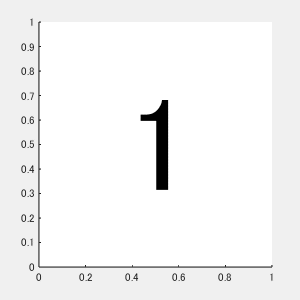
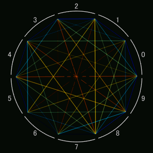
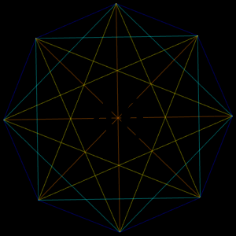

# Contest 2023: [MATLAB Flipbook Mini Hack](https://jp.mathworks.com/matlabcentral/contests/2023-matlab-mini-hack.html)

[Gallery](https://jp.mathworks.com/matlabcentral/communitycontests/contests/6/entries?contributor_id=14679670):
* [Bayesian optimization](https://jp.mathworks.com/matlabcentral/communitycontests/contests/6/entries/13352)
* [Incremental Lattice Design](https://jp.mathworks.com/matlabcentral/communitycontests/contests/6/entries/13357)
* [Simplex-lattice design](https://jp.mathworks.com/matlabcentral/communitycontests/contests/6/entries/13367)

関連するQiita記事:
* [MATLABでGIFアニメーションを作成するベストプラクティス](https://qiita.com/tomtkg/items/b4a40570f846988fafdc)
* [おぼろげながら浮かんできたんです 46という数字が](https://qiita.com/tomtkg/items/c4610899d402f50e6d54)

||||
|:-:|:-:|:-:|
|Bayesian optimization|Incremental Lattice Design|Simplex-lattice design|
||||
|Test|Emerging46_1|Emerging46_2|
